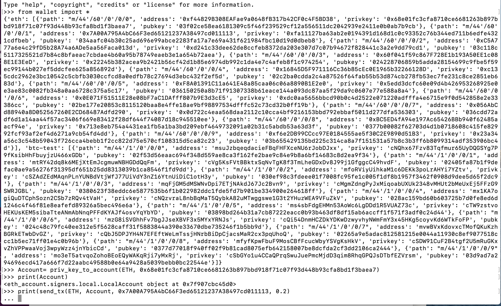

# Multi-Blockchain Wallet in Python


## Background and Wallet Description 

There aren't as many tools available in Python for managing multiple type of currencies in one wallet
Thankfully, I've found a command line tool, `hd-wallet-derive` that supports not only BIP32, BIP39, and BIP44, but
also supports non-standard derivation paths for the most popular wallets out there today! 

`hd-wallet-derive` is "universal" wallet and can manage billions of addresses across 300+ coins.

In this assignment, I will only get 2 coins working: Ethereum and Bitcoin Testnet.
Ethereum keys are the same format on any network, so the Ethereum keys should work with a custom networks or testnets.


## Dependencies

- PHP must be installed on your operating system (any version, 5 or 7). 

- Clone the [`hd-wallet-derive`](https://github.com/dan-da/hd-wallet-derive) tool.

- [`bit`](https://ofek.github.io/bit/) Python Bitcoin library.

- [`web3.py`](https://github.com/ethereum/web3.py) Python Ethereum library.

## Instructions

# HD Derive Wallet Install Guide

This guide serves as a step by step process for setting up the [`hd-wallet-derive` library](https://github.com/dan-da/hd-wallet-derive) used to derive `BIP32` addresses and private keys for Bitcoin and other alternative coins or "altcoins."

## hd-wallet-derive Installation

Now that the latest version of PHP is installed on our machines, we can now proceed to the installation of the `hd-wallet-derive` library.

Execute the following steps:

* Navigate to the [Github website](https://github.com/dan-da/hd-wallet-derive) for the `hd-wallet-derive` library and scroll down to the installation instructions.

 

* Next, open a terminal and execute the following commands. If you are using Windows, you will need to open the `git-bash` GUI via `C:\Program Files\Git\bin\bash.exe` directly to enable something called `tty` mode that makes the terminal more compatible with Unix systems. Once installed, you may move back to using the usual `git-bash` terminal.

> **Warning**: When cloning the project be conscious of what folder you are cloning the files into. It would probably be best to clone it into your `Blockchain-Tools` folder.

 ```shell
 git clone https://github.com/dan-da/hd-wallet-derive
 cd hd-wallet-derive
 php -r "readfile('https://getcomposer.org/installer');" | php
 php -d pcre.jit=0 composer.phar install
 ```

* You should now have a folder called `hd-wallet-derive` containing the PHP library.

## hd-wallet-derive Execution

* Using a command line navigate to your `hd-wallet-derive` folder.

 

* Run the following commands.

 ```shell
 ./hd-wallet-derive.php -g --key=xprv9tyUQV64JT5qs3RSTJkXCWKMyUgoQp7F3hA1xzG6ZGu6u6Q9VMNjGr67Lctvy5P8oyaYAL9CAWrUE9i6GoNMKUga5biW6Hx4tws2six3b9c
 ```

 ```shell
 ./hd-wallet-derive.php -g --key=xprv9tyUQV64JT5qs3RSTJkXCWKMyUgoQp7F3hA1xzG6ZGu6u6Q9VMNjGr67Lctvy5P8oyaYAL9CAWrUE9i6GoNMKUga5biW6Hx4tws2six3b9c --numderive=3 --preset=bitcoincore --cols=path,address --path-change
 ```

 

Wallet.py files runs all the functions which interact with hd-wallet-derive using the command line. The function below calls out the dictionary of coins with addresses and privkeys.

 `def derive_wallets(coin)`:
    `command = f'./derive -g --mnemonic="{mnemonic}" --cols=path,address,privkey,pubkey --format=json --coin="{coin}" --numderive= 2'`
    `p = subprocess.Popen(command, stdout=subprocess.PIPE, shell=True)`
    `output, err = p.communicate()`
    `p_status = p.wait()`
    `keys = json.loads(output)`
    `return keys`
  
`coins = {`
    `ETH: derive_wallets(ETH),`
    `BTCTEST: derive_wallets(BTCTEST)`
`}`
`print(coins)`



